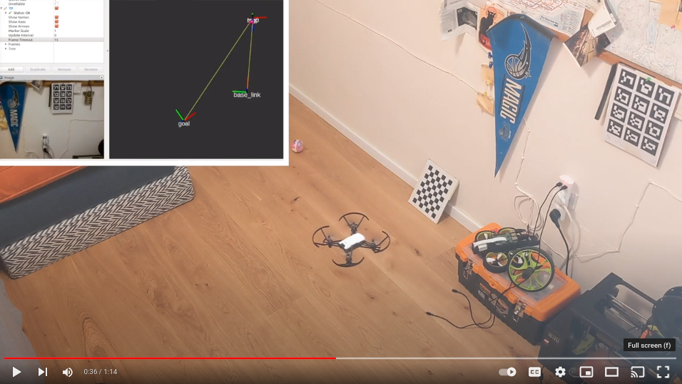

# Botello: Robot Tello Drone.

Demo video: 

[](http://www.youtube.com/watch?v=ZArmHUcMk7o "Botello Waypoint Demo Video")

This is an ongoing project in pursuit of _autonomizing_ a small Tello drone. To date (2022-04-28), the robot can localize itself with respect to a visual marker and follow waypoints. The goals of this project are:
1. Localize in a known map via landmark observations (e.g., markers, visual features, etc.).
2. Navigate to arbitrary points on the map. Start with straightshot navigation and improve it with proper path planning in an occupancy grid.
3. Experiment with onboard computation (Raspberry Pi Zero 2W?) for visual feature extraction and localization.

Let's recap what we have so far. Also, before we begin, ~I would like to point out that this is not a thorough installation guide. If you'd like to build this code locally and use it (and you are having trouble doing so), then let me know and I'll expand on the installation/build process.~ I actually ended up writing quite a bit about the installation process -- still, let me know if you need more.

# About Botello
pass
# Setup
My setup runs on Ubuntu 16.04 and ROS Kinetic. I installed PyAV with the following command: `python -m pip install av==0.5.2` and my Python version is: 2.7.12. The backbone of our communication with the Tello is owed to the great work done on the package [`tello_driver`](http://wiki.ros.org/tello_driver), I cannot emphasize enough how great the work on this package is! It allows us to do so much with the Tello. 

## If you want to install `botello`:

For the following commands, you'll need `catkin tools`.
```bash
# Clone/fork this repository into some location in your computer
$ git clone https://github.com/yoraish/botello.git  

# Navigate to the workspace.
$ cd botello/botello_ws

# Start by building only tello driver
$ catkin build tello_driver

# Build all the packages.
$ catkin build

# Source your setup file.
$ source path/to/botello_ws/devel_setup.bash # Or .zsh if you use that.

# Launch all the nodes (after connecting to the Tello via WiFi).
$ roslaunch botello_driver tello_driver.launch
```

And in a second terminal pane:

```
$ roslaunch botello_twist_keyboard botello_twist_keyboard.launch
```

If this does not work for you, then you should install `tello_driver` independently, then clone this repository, and finally replace `tello_driver` (of this repository) with the copy that you have installed independently.

I think installing `tello_driver` independently should solve some issues like 
```bash
    from tellopy._internal import tello
ImportError: No module named _internal
```

## If you want to ONLY install `tello_driver`:
To get it to work, I created a fresh workspace and installed `tello_driver` from source with the following:

```bash
# create some folder_ws/src, 
$ cd /path/to/the/folder_ws
$ catkin init 
$ cd src
$ git clone --recursive https://github.com/appie-17/tello_driver.git
$ cd ..
$ catkin build
$ source /path/to/the/folder_ws/devel/setup.bash # Or zsh if you use that like me.
$ roslaunch tello_driver tello_node.launch # To check if it works.
```

To keep `tello_driver` in this repository without making it a submodule (this is not good practice, sorry!), I ended up removing its `.git` directory.

